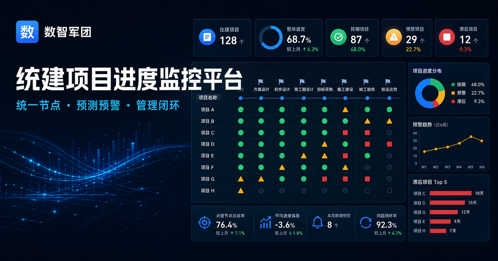

# 数智军团统建项目进度监控平台

面向几十个统建项目的组合级进度监控 Web 应用。平台以统一节点模板为基础，对不同项目的计划日期、实际进度与预测完成日期进行横向比较，并通过红、黄、绿状态帮助管理层快速识别偏差。



## 在线体验

[打开 Cloudflare 自定义域名站点](https://itpm.dougge.top)

> 管理大屏可用于态势查看；工作台的数据维护能力会按登录账号角色授权。

## 已实现能力

- 深色 1920×1080 管理驾驶舱
- 项目 × 标准节点红黄绿热力矩阵
- 组织、负责人、项目类型、健康度筛选和节点偏差下钻
- 组织、项目类型、负责人维度的组合健康分布与进度偏差分析
- 标准节点共性瓶颈排行、原始基线累计漂移分析及 CSV 报表导出
- 基于同类节点历史偏差的延期概率预测，融合进度、预测日期、风险、措施和周报时效
- 预测结果提供高/中/低风险、置信度、预计延期天数、提前预警及逐项概率驱动解释
- 延期概率随周度快照固化进入管理大屏口径，并纳入组合分析报表导出
- 基于锁定快照的跨周期新转红、恢复、持续红灯及节点瓶颈度量
- 近12/24/52周观察窗口、项目状态波动排行和历史明细导出
- 锁定快照口径的开放高风险、逾期措施和未来7日节点预警
- 人员、团队、供应商、环境四类共享资源池及每周可用容量治理
- 资源 × 周容量热力图、计划/确认投入拆分、85%满载预警和超配冲突排行
- 项目级/节点级资源分配、保存前冲突预检、PMO确认及超配原因强制留痕
- 资源冲突随周度快照固化进入管理大屏口径，并支持筛选和 CSV 报表导出
- 浅色桌面项目组合工作台，支持项目列表/节点热力双视图
- 项目综合健康度及扣分解释
- 项目详情最近12个正式周期的系统/申报进度曲线
- 周度进度填报与申报/计算进度校验
- 周报附件上传、下载、删除及锁定后防篡改
- 红黄节点偏差原因和纠偏措施闭环
- 基线变更审批及版本追溯
- PMO 数据质量检查与周度快照锁定
- D1 数据库与 Workers KV 文件持久化、服务端写入校验和操作审计
- 独立账号密码登录/退出、个人修改密码、管理员重置密码及管理层、PMO、项目经理权限边界
- 已锁定周期防篡改和重复审批保护
- 项目创建、标准节点自动初始化与项目主数据维护 API
- 手工新建项目按独立起止日期自动编排节点计划，支持逐节点校准并冻结原始基线
- Excel 三工作表模板下载、逐行预检和最多100项目的事务化批量导入
- 项目详情内基本信息编辑、负责人受控调整及操作审计
- 用户账号预置、角色管理、账号启停、规则版本发布和审计查询
- 项目负责人从已启用项目经理账号目录选择；创建、Excel 导入与负责人移交统一校验，仍负责项目的账号不能停用或变更角色
- 在建、已结项、已归档项目生命周期管理，支持结项检查、带原因例外结项、归档与恢复在建
- 结项/归档项目全业务只读，并自动退出周报催报、健康度重算、快照完整率与管理大屏当前口径
- 12节点标准模板持久化、权重/关键节点治理与动态大屏矩阵
- 项目级节点不适用、自定义节点及权重再分配
- 自定义节点候选池、PMO提升为标准草稿及现有项目零权重/不适用安全同步
- 风险与纠偏措施闭环、责任人/恢复日期跟踪和逾期识别
- 按进度、节点、风险、措施与周报自动重算可解释健康度
- 每日按上海时区自动刷新全量项目健康度，日期跨越、措施逾期和连续缺报无需人工触发
- 基线变更申请、批准/驳回和批准版本自动升级
- 快照带原因重新打开、修订后生成新版本及历史防篡改
- PMO 当前周期自动识别、真实待办/偏差队列及快照 JSON 导出
- 周三起自动催报、周五17:00自动锁数、缺报逾期通知与锁定口径红灯升级
- 站内通知中心、未读计数、单条/批量已读和业务页面跳转
- PMO 单项目及批量周报催报、红灯项目多角色升级与重复通知去重
- 企业微信、钉钉和通用 Webhook 外部通知渠道，支持事件订阅、启停和测试
- 外部投递按渠道/项目/周期去重，失败后按5分钟、30分钟、2小时退避重试
- 投递日志、失败原因与人工重试留痕，站内通知始终作为可靠兜底
- Webhook凭据仅在服务端使用，页面/API全程脱敏，官方渠道强制HTTPS域名校验
- 基线变更批准/驳回结果自动通知申请人
- 预警规则历史版本查询及当前生效版本标识
- 节点阈值、进度/风险/措施/周报扣分、分类封顶及一票否决条件统一版本化，发布后自动重算全部在建项目
- 项目健康度持久化保存规则版本、分类扣分、触发数量和一票否决原因，详情页可逐项解释
- 桌面端和移动端响应式布局
- 自动化服务端渲染和关键流程结构测试

## 业务规则

- 普通节点：偏差不超过 3 天为绿，4–7 天为黄，8 天及以上为红。
- 关键节点：无延期为绿，延期 1–3 天为黄，4 天及以上为红。
- 未到期节点按预测完成日预警，已完成节点按实际完成日度量。
- 项目综合健康度由进度偏差、节点状态、风险、措施逾期和数据新鲜度共同计算。
- 关键节点红色、高风险措施逾期或连续两个周期未填报可触发项目红色一票否决。
- PMO 可在规则中心调整全部综合评分参数；每次发布生成不可覆盖的新版本，并随周度快照固化当期规则。
- 项目结项前检查未完成节点、开放风险、未完成措施和待审批基线；例外结项必须记录原因，恢复在建后才能继续处理。

## 技术栈

- React 19
- Next.js App Router
- Vinext + Vite
- TypeScript
- Tailwind CSS
- Cloudflare Workers、D1、Workers KV
- Node.js Test Runner

## 本地运行

环境要求：Node.js 22 LTS（22.13 或更高版本）。

```bash
npm ci
npm run db:local:apply
npm run dev
```

默认访问地址由开发服务器输出。

生产环境需设置 `APP_ADMIN_EMAILS` 和至少 32 位的 `APP_SESSION_SECRET`。管理员通过“系统管理”创建独立账号、初始密码并分配角色。

生产站点未登录时展示安全登录页，不会回退展示演示项目；本地 `localhost` 开发环境使用管理员演示身份，便于功能验证。

全新数据库只自动初始化标准节点模板与默认规则，不写入示例项目。若需要一次性演示数据，可在空的临时数据库中显式设置 `SEED_DEMO_DATA=true`；正式环境应保持为 `false`。已有项目库不会因该配置被覆盖或删除。

## 构建与测试

```bash
npm run build
node --test tests/*.test.mjs
```

启动本地服务后，可执行 50 个项目 × 12 个节点的规模回归；脚本会按需补齐本地测试项目，并验证 `/api/bootstrap` 五次采样的 P95 不超过 3 秒：

```bash
npm run test:scale
```

## 项目结构

```text
app/
  page.tsx          主要业务页面与交互
  api/              周报、基线、快照及数据初始化 API
  globals.css       大屏、工作台及响应式视觉系统
db/                 D1 持久化模型
drizzle/            数据库迁移
tests/              自动化测试
worker/             Cloudflare Worker 入口
public/             品牌与分享资源
```

## Cloudflare 部署

应用完整运行于 Cloudflare Workers，业务数据存储于 D1，附件存储于 Workers KV，`itpm.dougge.top` 通过 Workers Custom Domain 管理域名和证书，不依赖外部站点源。

```bash
npm run db:remote:apply
npm run deploy:cloudflare
```

## 当前阶段

当前版本已完成高保真界面、Cloudflare D1/KV 持久化、独立账号身份权限、项目和用户管理、项目生命周期、负责人账号目录闭环、Excel批量导入、12节点模板治理、自定义节点候选提升、规则版本、风险措施闭环、周报附件、站内及外部通知、催报升级、组合分析、延期概率预测、跨周期事后度量、跨项目资源容量与冲突治理、报表导出、核心工作流 API 及审计能力。后续将继续扩展预算与质量健康度、资源需求预测和更完整的业务分支回归。
