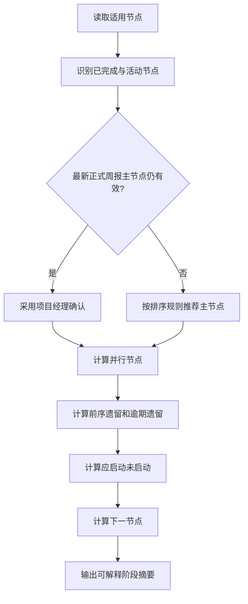

# 项目节点阶段设计与开发指南

## 1. 目标与设计原则

本方案解决“完成度能说明做了多少，但不能清晰说明项目当前做到哪一步”的问题。系统在保留计划、预测、实际和红黄绿口径的基础上，新增可审计的**节点执行状态**和可解释的**项目当前阶段**。

设计原则：

1. **事实与推断分离**：项目经理维护节点执行状态并确认当前主节点；系统只在没有有效确认时推荐主节点。
2. **支持真实并行**：一个项目可有多个进行中或暂停节点，但只有一个当前主节点。
3. **不隐藏历史欠项**：主节点之前尚未完成的节点标记为前序遗留；其中计划完成日已过的同时标记为逾期遗留。
4. **计划驱动提醒**：计划开始日已到、但仍未开始的节点进入“应启动未启动”检查项。
5. **快照口径稳定**：管理大屏和PDF使用最新已锁定快照中的阶段结果，不被锁数后的实时修改影响。
6. **兼容历史数据**：旧数据没有执行状态时，允许根据完成度推断；旧快照没有阶段字段时，在读取时兼容计算。

## 2. 业务定义

### 2.1 节点执行状态

| 状态 | 符号 | 业务含义 | 必填规则 |
|---|---|---|---|
| 未开始 `not_started` | ○ | 尚未实际启动 | 完成度必须为0，不得填写实际开始/完成日 |
| 进行中 `in_progress` | ▶ | 已实际启动并持续推进 | 完成度小于100，正式提交必须填写实际开始日 |
| 暂停 `paused` | Ⅱ | 已启动但当前暂停 | 完成度小于100，必须填写实际开始日和暂停原因 |
| 已完成 `completed` | ✓ | 已达到完成标准 | 完成度必须为100，必须填写实际完成日 |

完成度下降、或已完成节点回退到其他状态时，必须填写不少于10个字符的调整原因。实际完成日不得早于实际开始日。

### 2.2 项目阶段角色

| 角色 | 计算口径 | 展示 |
|---|---|---|
| 当前主节点 | 最新正式周报中项目经理确认的有效活动节点；没有有效确认时，由系统在活动节点中推荐 | `主`、◆ |
| 并行节点 | 除主节点外，执行状态为进行中或暂停的未完成节点 | `并` |
| 前序遗留 | 序号早于主节点且尚未完成的适用节点 | `遗` |
| 逾期遗留 | 前序遗留中计划完成日早于阶段度量日的节点 | 红色遗留提示 |
| 应启动未启动 | 计划开始日已到、节点未完成且状态仍不是进行中/暂停 | `! 应启动` |
| 下一节点 | 主节点之后序号最靠前的未完成节点；没有主节点时优先选择未来最近节点 | `下一节点` |

同一个节点可以同时属于“并行节点”和“前序遗留”。这表示该欠项仍在并行收口，并非数据冲突。

### 2.3 系统推荐主节点排序

当没有有效的项目经理确认时，活动节点按以下顺序推荐：

1. 进行中优先于暂停；
2. 关键节点优先；
3. 已过计划完成日的节点优先；
4. 计划完成日较早者优先；
5. 节点序号较小者优先。

推荐结果必须展示“系统推荐”，不能伪装成项目经理确认。

## 3. 数据模型

### 3.1 `milestones`新增字段

| 字段 | 类型 | 说明 |
|---|---|---|
| `execution_status` | text | 未开始、进行中、暂停、已完成 |
| `actual_start` | text | 实际开始业务日期，格式`YYYY-MM-DD` |
| `paused_reason` | text | 暂停原因 |
| `execution_updated_at` | text | 最近执行状态更新时间 |
| `execution_updated_by` | text | 最近更新账号 |

原有`completion`、`forecast_finish`、`actual_finish`、`reason`继续保留，并与执行状态联合校验。

### 3.2 `weekly_reports`新增字段

| 字段 | 类型 | 说明 |
|---|---|---|
| `primary_milestone_id` | integer | 本周期项目经理确认的当前主节点 |
| `milestone_updates_json` | text | 本周期多节点更新的不可变业务记录 |

周报草稿继续保存在`draft_json`。正式提交后，同时更新节点实时表并保留周报中的提交时记录，便于审计和历史还原。

### 3.3 快照结构

快照JSON新增：

- `projectStages`：每个项目的阶段状态、主节点依据、并行/遗留/应启动/下一节点；
- `stageDataQuality`：未人工确认主节点、应启动未启动、前序遗留等PMO质量清单。

## 4. 核心计算流程



阶段度量日：工作台使用当前UTC+8业务日期；管理大屏、PDF和快照质量检查使用快照锁定时的UTC+8业务日期。

## 5. 用户流程与界面落点

### 5.1 项目经理周报

1. 进入“项目详情 → 更新本周进度”；
2. 从节点下拉框依次选择本周需要更新的多个节点；
3. 为每个节点填写执行状态、完成度、实际开始日、预测/实际完成日和原因；
4. 红黄或逾期节点逐一填写对应纠偏措施；
5. 在全部进行中/暂停节点中单选一个当前主节点；
6. 节点队列保留已编辑数据，允许切换、删除和继续编辑；
7. 保存草稿后再次进入应恢复全部节点更新、主节点及措施；
8. 正式提交由服务端再次校验，禁止绕过主节点、日期和措施规则。

### 5.2 项目详情与项目组合

- 项目详情顶部显示“当前主节点、并行节点、前序遗留、下一节点”和确认依据；
- 节点列表显示执行状态，以及`主/并/遗`角色；
- 项目组合列表新增“当前节点”列；
- 工作台节点矩阵在节点单元格显示`主/并/遗`，点击进入项目详情。

### 5.3 管理大屏与PDF

- 时间轴项目列显示主节点、并行数、遗留数；没有活动节点但存在应启动项时显示警示；
- 时间轴节点标签高亮主节点，抽屉显示执行状态、实际开始日和暂停原因；
- 项目×节点矩阵使用`主/并/遗`角色替代普通状态符号，但保留灯色和偏差；
- PDF每个项目行显示当前阶段摘要，阶段数据来自锁定快照。

### 5.4 PMO质量检查

锁数前至少检查：

1. 活动项目是否由项目经理确认主节点；
2. 是否存在应启动未启动节点；
3. 是否存在前序遗留及逾期遗留；
4. 周报是否缺报、申报偏差是否异常；
5. 红黄节点纠偏措施是否完整。

质量项用于下钻和提示，不默认阻断锁数；PMO可结合组织制度决定是否允许带问题锁数。

## 6. API契约

### 6.1 多节点周报

`POST /api/projects/{projectId}/weekly-reports`

```json
{
  "submitMode": "submitted",
  "weekKey": "2026-W33",
  "declaredProgress": 48,
  "reason": "本周完成评审并启动开发，申报口径包含已验收的补充工作。",
  "primaryMilestoneId": 105,
  "milestoneUpdates": [
    {
      "milestoneId": 104,
      "executionStatus": "paused",
      "completion": 80,
      "actualStart": "2026-07-20",
      "forecastFinish": "2026-08-12",
      "pausedReason": "等待外部接口联调窗口",
      "reason": "已完成内部工作，外部接口尚未开放。"
    },
    {
      "milestoneId": 105,
      "executionStatus": "in_progress",
      "completion": 35,
      "actualStart": "2026-08-01",
      "forecastFinish": "2026-08-28",
      "reason": "核心功能已进入迭代开发。"
    }
  ],
  "actions": [
    {
      "milestoneId": 104,
      "name": "接口联调专项",
      "owner": "张三",
      "recoveryDate": "2026-08-12",
      "detail": "每日跟踪接口开放情况并准备模拟数据。"
    }
  ]
}
```

兼容旧版单节点`milestone`和单措施`action`请求。新客户端必须使用`milestoneUpdates`，正式提交时只要仍有活动节点，就必须传入有效`primaryMilestoneId`。

### 6.2 单节点执行状态

`PUT /api/projects/{projectId}/milestones/{milestoneId}/execution`

用于项目详情直接维护节点执行状态。权限、项目生命周期锁定、状态校验、健康度重算和操作审计与周报保持一致。日常管理仍优先通过周报更新，以形成周期记录。

### 6.3 Bootstrap与快照兼容

`GET /api/bootstrap`在项目对象中返回`stageSummary`，并解析周报中的`milestoneUpdates`。对于旧快照，服务端按快照节点数据计算兼容阶段摘要；新快照直接返回锁数时固化结果。

## 7. 权限、审计与异常处理

- 管理层：只读查看工作台、大屏和PDF；
- 项目经理：仅更新本人负责的在建项目；
- PMO/系统管理员：更新全部在建项目并处理质量问题；
- 结项和归档项目禁止执行状态与周报更新；
- 周报草稿、正式提交、单节点执行状态更新均写入操作审计；
- 节点执行更新记录操作者和更新时间；
- 不适用节点禁止更新执行状态。

## 8. 开发实施顺序

1. 应用`drizzle/0018_project_stage.sql`；
2. 部署数据模型、校验模块和阶段算法；
3. 部署周报和单节点API；
4. 部署快照及Bootstrap兼容层；
5. 部署工作台、双大屏和PDF；
6. 先锁定测试快照，核对实时与快照口径；
7. 生产发布时必须先完成远程D1迁移，再发布依赖新字段的代码。

## 9. 验收用例

| 场景 | 预期结果 |
|---|---|
| 一个进行中节点且已确认 | 显示为当前主节点，依据为项目经理确认 |
| 多个活动节点 | 一个主节点，其余为并行节点 |
| 主节点之前有未完成节点 | 同时显示前序遗留；计划已过则显示逾期遗留 |
| 计划开始日已到但仍未开始 | 进入应启动未启动清单 |
| 没有人工确认但有活动节点 | 系统推荐主节点并明确标注推荐依据 |
| 主节点本周完成且仍有其他活动节点 | 必须重新确认一个有效主节点才能正式提交 |
| 暂停节点未填暂停原因 | 服务端拒绝提交 |
| 周报同时更新两个红黄节点 | 两个节点必须分别绑定纠偏措施 |
| 锁数后修改实时节点 | 历史大屏和PDF仍保持锁数时阶段结果 |
| 旧快照不含阶段字段 | 可兼容打开，不报错，并标识为历史推断或系统推荐 |

## 10. 当前实现文件索引

- 数据模型：`db/schema.ts`、`drizzle/0018_project_stage.sql`
- 阶段算法：`lib/project-stage.ts`
- 执行状态校验：`lib/milestone-execution.ts`
- 周报API：`app/api/projects/[id]/weekly-reports/route.ts`
- 单节点API：`app/api/projects/[id]/milestones/[milestoneId]/execution/route.ts`
- 快照：`lib/snapshot-service.ts`
- Bootstrap：`app/api/bootstrap/route.ts`
- 工作台：`app/page.tsx`
- 时间轴：`app/timeline-cockpit.tsx`、`lib/timeline-cockpit.ts`
- PDF：`app/cockpit-print-report.tsx`
- 自动化测试：`tests/project-stage.test.mjs`、`tests/milestone-execution.test.mjs`、`tests/project-stage-integration.test.mjs`
